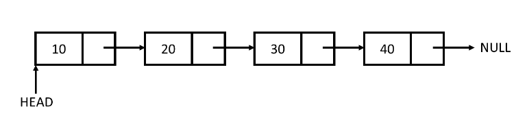
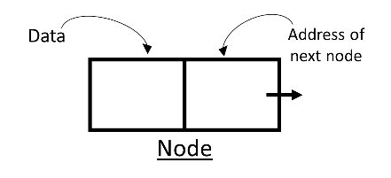
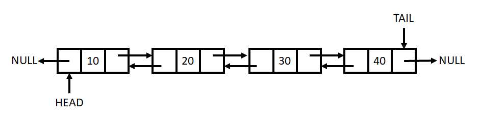
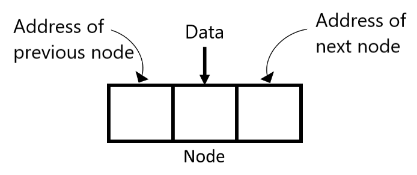

## LinkedList

Stores Nodes in 2 parts (data + address). Nodes are in non-consecutive memory locations.

Elements are linked using pointers.

### Singly Linked List

#### Node

### Doubly Linked List

#### Node

### Advantages
- Dynamic Data Structure (allocates needed memory while running).
- Insertion and Deletion of Nodes is easy O(1).
- No / Low memory waste.

### Disadvantages
- Greater memory usage (additional pointer(address to the next/previous pointer)).
- No random access of elements (no index[i]).
- Accessing/searching elements is more time consuming O(n).

### Uses of LinkedList
- Implement Stacks/Queues.
- GPS navigation.
- Music playlist.