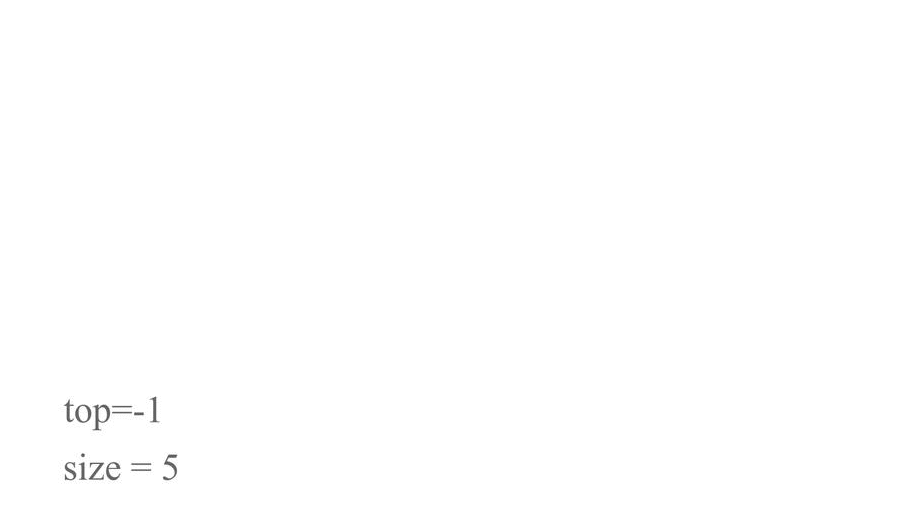

## Stack

    Stack is a <bold>LIFO</bold> data structure. Last-In First-Out.

    Stores objects into a sort of "vertical" tower.

- push() -> To add to the top.

- pop() -> To remove from the top.

## Uses of stack

- Undo / Redo features in text editors.
- Moving back / forward through browser history
- Backtracking algorithms (search through file directories)
- Calling functions (call stack)